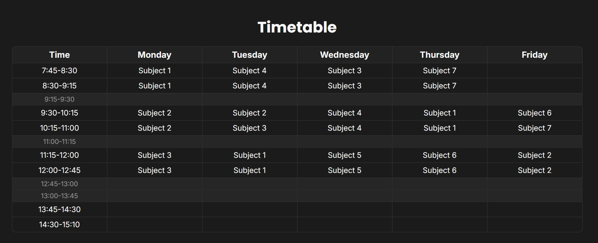

# Timetable

Timetable is an easy-to-use website that displays your timetable for school or work in an aesthetic way. 
By following plain web-development logic, this project doesn't require much boilerplate and can be changed to your personal needs even without much knowledge.

## How to use

> Note: This project requires both Google-Fonts "Inter" and "Poppins". You can either change the used fonts in the source-code or install them, if you haven't already.

First, you need to clone this repository using `git clone https://github.com/KingiDE/Timetable.git`.
Then, simply start a dev server using the [Live Server](https://marketplace.visualstudio.com/items?itemName=ritwickdey.LiveServer) extension and type your specific values into the inputs fields inside the table.
Obviously, you can adjust the entire layout and style yourself by editing the `index.html`- and `styles.css`-files. 
When you're finished, use your favourite screenshot-tool to save your result. Finally, you can take this image as a background or a widget to find your next class or room easier.   

## Backstory

Timetable originally was an one-weekend-project that I created to produce a good looking overview of my timetable for school. 
At one point I decided to release this idea to let many other people profit from this "software".
In my case, I use this website to create a widget for my tablet. 
